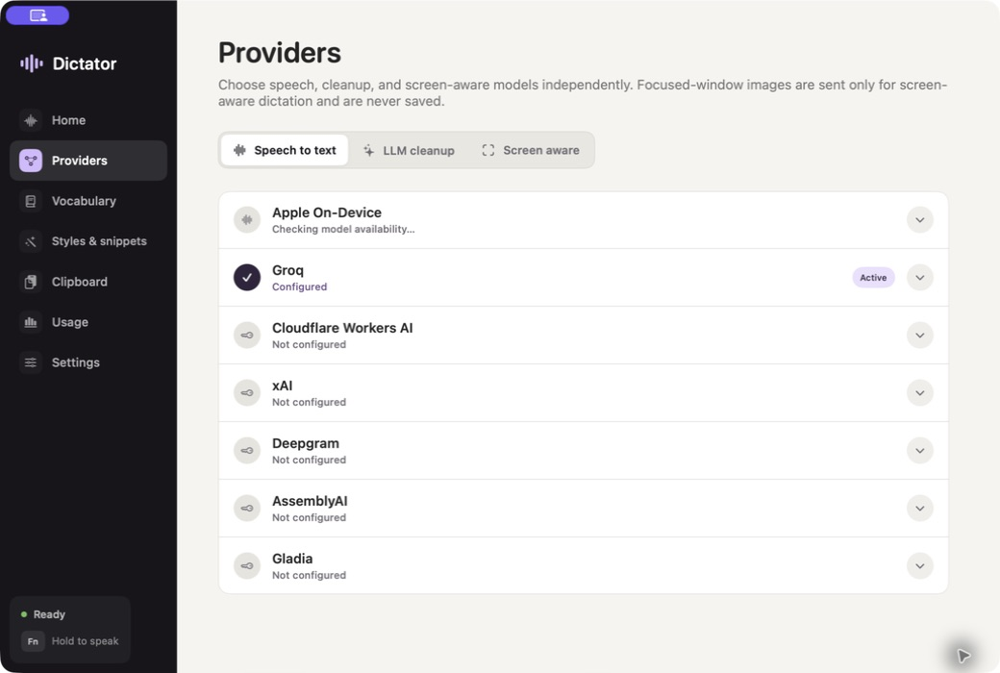

# Dictator

Dictator is a native macOS menu-bar app for dictation and screen-aware writing. Hold `Fn` or a configured extra mouse button to dictate, or hold `Control-Option` to speak an instruction that uses the focused window as context. Dictator inserts the result into the field that was focused when recording began; if no editable field was focused, it uses its private clipboard.

> ⚠️ Dictator is still in the early stages of development. Expect rough edges.



## Shortcuts

- Hold `Fn` (or a configured extra mouse button): record dictation
- Hold `Control-Option`: compose or transform text using the focused window
- `Option-Command-V`: paste the latest private-clipboard item
- `Option-Shift-Command-V`: open the private clipboard

Set the dictation trigger under Settings → Shortcuts by pressing a key combination, F-key, or extra mouse button. Mouse buttons remain hold-to-talk: press to record and release to transcribe.

## Providers

On macOS 26 and later, Apple On-Device is available without an API key and is the default for new installations. Its language model may require an initial download; after that, audio transcription stays on the Mac. SpeechTranscriber is preferred, with DictationTranscriber used when needed for the selected language or hardware.

Cloud speech-to-text adapters remain available: Groq, Cloudflare Workers AI, xAI, Deepgram, AssemblyAI, and Gladia. On macOS 14 and 15, these are the available speech providers and Groq remains the new-install default.

Optional cleanup adapters use BYOK credentials: Groq, Cloudflare Workers AI, Gemini, xAI, OpenRouter, and any OpenAI-compatible endpoint. Cleanup sends transcript text, never audio. When speech-to-text and cleanup use the same provider, Dictator reuses that provider credential unless you configure a separate cleanup credential. Keys are stored in macOS Keychain. Transcript history, vocabulary, styles, snippets, and private-clipboard data stay in local Application Support storage. Cloud recordings are sent to the selected speech provider and are not stored by Dictator after processing; the provider's own data-handling policy applies.

Screen Aware is a separate, disabled-by-default mode for composing or transforming text from the focused window. Hold `Control-Option`, speak an instruction, and release; Dictator transcribes the audio, captures only the focused window, and sends the image, spoken instruction, app and window details, and selected text when available to your selected vision-capable provider. Screen Aware supports Groq, Gemini, xAI, OpenRouter, and OpenAI-compatible endpoints. Focused-window images are never saved by Dictator; the selected provider's own data-handling policy applies.

## Install

Homebrew is the recommended installation method:

```sh
brew install --cask amalshaji/taps/dictator
```

Dictator checks for updates once a day with [Sparkle](https://sparkle-project.org). It shows the release notes and always asks before installing. Automatic checks can be disabled under **Settings → Updates**, and **Check for Updates…** is also available from the app and menu-bar menus.

Stable updates are the default. Enable **Receive canary updates** under **Settings → Updates** to test early builds published after successful merges to `main`. Canary builds may be unstable. Disabling the setting keeps the installed build until a newer stable version is available; it does not downgrade the app.

### Manual installation

Download `Dictator-<version>-universal.dmg` and `SHA256SUMS.txt` from the matching [GitHub Release](https://github.com/amalshaji/dictator/releases), then verify the download:

```sh
shasum -a 256 -c SHA256SUMS.txt
```

Open the DMG and drag Dictator to Applications. Dictator is currently ad-hoc signed rather than Apple-notarized, so remove quarantine from this app bundle only before opening it:

```sh
/usr/bin/xattr -dr com.apple.quarantine "/Applications/Dictator.app"
```

Only run that command for the checksum-verified artifact downloaded from the official release. It does not disable Gatekeeper globally or make the app notarized.

## Build and test

```sh
xcodegen generate
xcodebuild -project Dictator.xcodeproj -scheme Dictator -configuration Debug -destination 'platform=macOS' build
xcodebuild -project Dictator.xcodeproj -scheme Dictator -configuration Debug -destination 'platform=macOS' test
```

Live integration tests read provider keys from `.env` and skip providers that are not configured. Every configured STT provider receives the same `Tests/Fixtures/reference.wav` input.

```dotenv
GROQ_API_KEY=
CLOUDFLARE_API_TOKEN=
CLOUDFLARE_ACCOUNT_ID=
XAI_API_KEY=
DEEPGRAM_API_KEY=
ASSEMBLYAI_API_KEY=
GLADIA_API_KEY=
GEMINI_API_KEY=
OPENROUTER_API_KEY=
```

The app needs Microphone and Accessibility/Input Monitoring permission for recording, global shortcuts, focus detection, and insertion. Screen Recording permission is required only for Screen Aware.

## Release process

Every successful CI run for a push to `main` publishes an immutable GitHub prerelease and adds it to the opt-in `canary` Sparkle channel. The latest ten canary releases and tags are retained. Canary releases never update Homebrew.

Stable releases remain review-gated:

1. Bump `MARKETING_VERSION` in `project.yml`.
2. Open a PR, apply the `release` label, and merge it into `main` after CI passes.
3. The merge creates `v<version>` and builds a draft GitHub Release containing the universal DMG, checksum, and provenance attestation.
4. Review and publish the draft release.
5. Publication signs and deploys the Sparkle appcast to the `gh-pages` branch and bootstraps or updates `Casks/dictator.rb` in [`amalshaji/homebrew-taps`](https://github.com/amalshaji/homebrew-taps).

Configure a protected GitHub environment named `release` with:

- `SPARKLE_PRIVATE_KEY`: the private Ed25519 key whose public half is committed as `SUPublicEDKey`.
- `HOMEBREW_TAP_TOKEN`: a fine-grained token with Contents read/write access only to `amalshaji/homebrew-taps`.

Do not add required reviewers to the `release` environment if canaries must remain fully automatic.

Configure GitHub Pages to use **GitHub Actions** as its source. The publishing workflow keeps the signed feed on `gh-pages` for rollback and deploys that exact feed to `https://amalshaji.github.io/dictator/appcast.xml` with GitHub's Pages deployment action. Keep an encrypted offline backup of the Sparkle private key; without Developer ID signing, losing it prevents trusted key rotation for existing installations.
