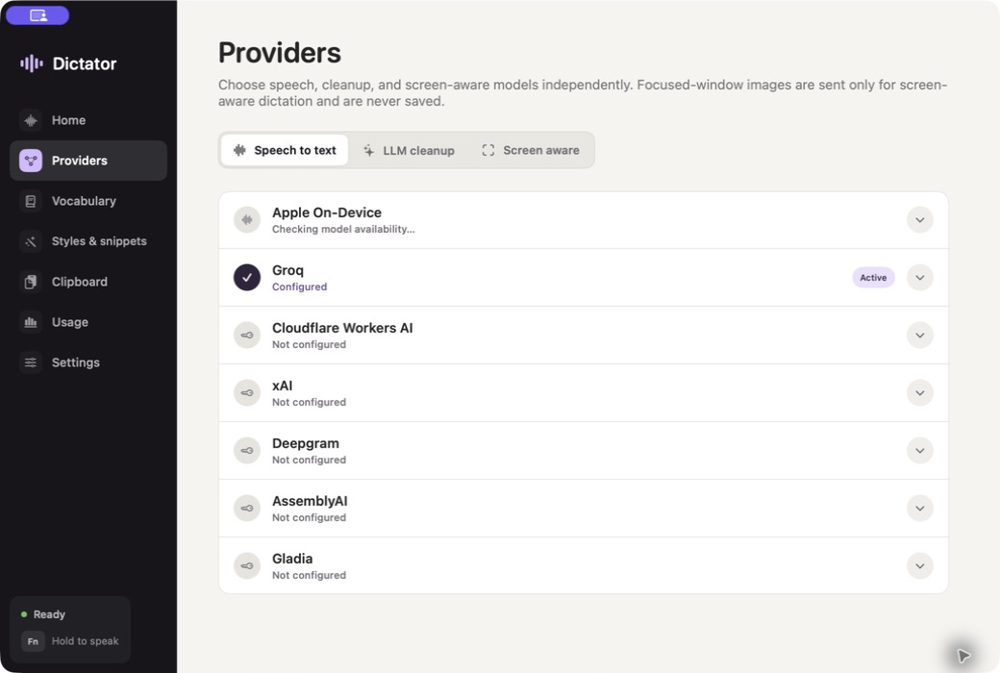

# Dictator

Dictator is a native macOS menu-bar app for dictation and screen-aware writing. In the default least-privilege mode, start recording from the menu bar, stop from the pill below the notch or menu bar, and press `Command-V` to paste the copied transcript. This mode requests Microphone access only.

> ⚠️ Dictator is still in the early stages of development. Expect rough edges.



## Recording and access modes

During onboarding, choose one of two access modes:

- **Use with least privileges** (recommended): Microphone permission only. Start and stop from Dictator's menu-bar menu or stop from the recording pill; every transcript is copied to the system clipboard.
- **Use system-wide**: adds global shortcuts, focused-field insertion, and optional screen-aware dictation. This mode requires Accessibility and Input Monitoring; Screen Recording is requested only when you enable Screen Aware.

You can switch modes later under **Settings → Access mode**. Switching to least privileges disables privileged features and returns result delivery to the clipboard.

System-wide mode provides these shortcuts:

- Hold `Fn`: record dictation
- Hold `Control-Option`: compose or transform text using the focused window
- `Option-Command-V`: paste the latest private-clipboard item
- `Option-Shift-Command-V`: open the private clipboard

## Providers

On macOS 26 and later, Apple On-Device is available without an API key and is the default for new installations. Its language model may require an initial download; after that, audio transcription stays on the Mac. SpeechTranscriber is preferred, with DictationTranscriber used when needed for the selected language or hardware.

Cloud speech-to-text adapters remain available: Groq, Cloudflare Workers AI, xAI, Deepgram, AssemblyAI, and Gladia. On macOS 14 and 15, these are the available speech providers and Groq remains the new-install default.

Optional cleanup adapters use BYOK credentials: Groq, Cerebras, Cloudflare Workers AI, Gemini, xAI, OpenRouter, and any OpenAI-compatible endpoint. Cleanup sends transcript text, never audio. When speech-to-text and cleanup use the same provider, Dictator reuses that provider credential unless you configure a separate cleanup credential. Keys are stored in macOS Keychain. Transcript history, vocabulary, styles, snippets, and private-clipboard data stay in local Application Support storage. Cloud recordings are sent to the selected speech provider and are not stored by Dictator after processing; the provider's own data-handling policy applies.

Screen Aware is a separate, disabled-by-default mode for composing or transforming text from the focused window. Hold `Control-Option`, speak an instruction, and release; Dictator transcribes the audio, captures only the focused window, and sends the image, spoken instruction, app and window details, and selected text when available to your selected vision-capable provider. Screen Aware supports Groq, Gemini, xAI, OpenRouter, and OpenAI-compatible endpoints. Focused-window images are never saved by Dictator; the selected provider's own data-handling policy applies.

## Install

Homebrew is the recommended installation method:

```sh
brew install --cask amalshaji/taps/dictator
```

To uninstall, run `brew uninstall --cask dictator`.

Dictator checks for updates once a day with [Sparkle](https://sparkle-project.org). It shows the release notes and always asks before installing. Automatic checks can be disabled under **Settings → Updates**, and **Check for Updates…** is also available from the app and menu-bar menus.

Stable updates are the default. Enable **Receive canary updates** under **Settings → Updates** to test early builds published after successful merges to `main`. Canary builds may be unstable. Disabling the setting keeps the installed build until a newer stable version is available; it does not downgrade the app.

### Manual installation

Download `Dictator-<version>-universal.dmg` and `SHA256SUMS.txt` from the matching [GitHub Release](https://github.com/amalshaji/dictator/releases), then verify the download:

```sh
shasum -a 256 -c SHA256SUMS.txt
```

Open the DMG and drag Dictator to Applications. Release artifacts are Developer ID-signed and notarized by Apple, with the notarization ticket stapled to the DMG for Gatekeeper verification.

## Build and test

```sh
scripts/xcodegen.sh generate
xcodebuild -project Dictator.xcodeproj -scheme Dictator -configuration Debug -destination 'platform=macOS' build
xcodebuild -project Dictator.xcodeproj -scheme Dictator -configuration Debug -destination 'platform=macOS' test
```

The project wrapper downloads and checksum-verifies the repository-pinned XcodeGen version on first use.

Live integration tests read provider keys from `.env` and skip providers that are not configured. Every configured STT provider receives the same `Tests/Fixtures/reference.wav` input.

```dotenv
GROQ_API_KEY=
CLOUDFLARE_API_TOKEN=
CLOUDFLARE_ACCOUNT_ID=
XAI_API_KEY=
DEEPGRAM_API_KEY=
ASSEMBLYAI_API_KEY=
GLADIA_API_KEY=
GEMINI_API_KEY=
OPENROUTER_API_KEY=
CEREBRAS_API_KEY=
```

Least-privilege mode needs only Microphone permission. System-wide mode additionally needs Accessibility and Input Monitoring for global shortcuts, focus detection, and insertion. Screen Recording permission is required only for Screen Aware.

## Release process

Every successful CI run for a push to `main` publishes an immutable GitHub prerelease and adds it to the opt-in `canary` Sparkle channel. The latest ten canary releases and tags are retained. Canary releases never update Homebrew.

Stable releases remain review-gated:

1. Manually run **Build stable release** from `main` and choose `patch`, `minor`, `major`, or `explicit`. When choosing `explicit`, also enter the exact semantic version in the `explicit_version` input.
2. The workflow validates the choice, creates a version-only release PR, and resolves the release identity from its candidate commit. If an earlier run already merged an unfinished version, the workflow safely reuses it instead of applying another bump.
3. The workflow builds a Developer ID-signed universal app, notarizes and staples its DMG, then verifies and attests the DMG and checksum without creating a tag. Approve the generated release PR, review the completed preparation job, then approve its `stable-release` environment deployment.
4. Finalization squash-merges the approved PR, proves the merged tree, version, and build match the verified artifacts, then creates the annotated `v<version>` tag and public GitHub Release. It subsequently signs and deploys the Sparkle appcast and bootstraps or updates `Casks/dictator.rb` in [`amalshaji/homebrew-taps`](https://github.com/amalshaji/homebrew-taps).

Create a protected GitHub environment named `stable-release` with the repository owner as its required reviewer, self-review allowed, deployments restricted to `main`, and no secrets. A failed or expired preparation creates no tag; rerun the stable workflow with the same selection to reuse the open release PR or resume its merged version. If only update-channel publication fails after the release is public, repair it with the **Publish update channels** workflow and the same tag.

Configure a protected GitHub environment named `release` with:

- `APPLE_CERTIFICATE`: the base64-encoded PKCS#12 (`.p12`) export containing the Developer ID Application certificate and private key.
- `APPLE_CERTIFICATE_PASSWORD`: the password used to protect the PKCS#12 export.
- `APPLE_SIGNING_IDENTITY`: `Developer ID Application: Amal Shaji (6NJKY8HB47)`.
- `APPLE_ID`: the Apple Account used for notarization.
- `APPLE_APP_SPECIFIC_PASSWORD`: an app-specific password for `notarytool`.
- `APPLE_TEAM_ID`: `6NJKY8HB47`.
- `SPARKLE_PRIVATE_KEY`: the private Ed25519 key whose public half is committed as `SUPublicEDKey`.
- `HOMEBREW_TAP_TOKEN`: a fine-grained token with Contents read/write access only to `amalshaji/homebrew-taps`.

Do not add required reviewers to the `release` environment if canaries must remain fully automatic.

Configure GitHub Pages to use **GitHub Actions** as its source. The publishing workflow keeps the signed feed on `gh-pages` for rollback and deploys that exact feed to `https://amalshaji.github.io/dictator/appcast.xml` with GitHub's Pages deployment action. Keep encrypted offline backups of both signing keys; losing the Sparkle private key prevents trusted key rotation for existing installations, while losing the Developer ID private key requires replacing the certificate and CI secret before another release can be signed.
